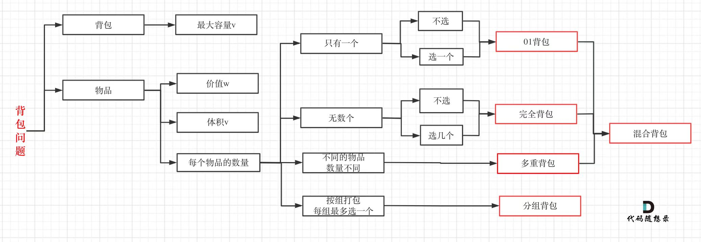

求组合问题的转移公式(494-目标和)
dp[j] += dp[j - nums[i]]

01背包的递推公式(最后要算重量)
dp[j] = Math.max(dp[j], dp[ j - nums[i]] + nums[i])

完全背包：物品的数量无限，唯一和 01 背包不一样的就是遍历顺序不同
对于 01 背包,二维数组先遍历谁都可以，一维先遍历物品再遍历容量
`

    for(let i = 0;i<weight.length;i++){
        for(let j = bagWeight; j >= weight[i];j--){
            dp[i] = Math.max(dp[j], dp[j - weight[i] + value[i]])
        }
    }

`
对于完全背包，因为物品可以不只放进一次，所以内嵌循环从小到大遍历，一、二维数组先遍历谁都可以
leetcode复习草稿的 p13 分析了零钱兑换|| 的过程，可以参考一下。
1. 先物品后背包
`   
      for(let i = 0;i<weight.length;i++){
        for(let j = weight[i]; j<= bagWeight;j++){
            dp[i] = Math.max(dp[j], dp[j - weight[i] + value[i]]);
        }
    }
`

2.先背包 后物品
`
 for(let j = 0;j<bagWeight;j++){
     for(let i = 0;i < weight.length;i++){
         if(j - weight[i] > 0){
             dp[j] = Math.max(dp[j],dp[j - weight[i]]+ value[i])
         }
     }
 }
`
重刷
474-一和零
279-完全平方数
139-单词拆分